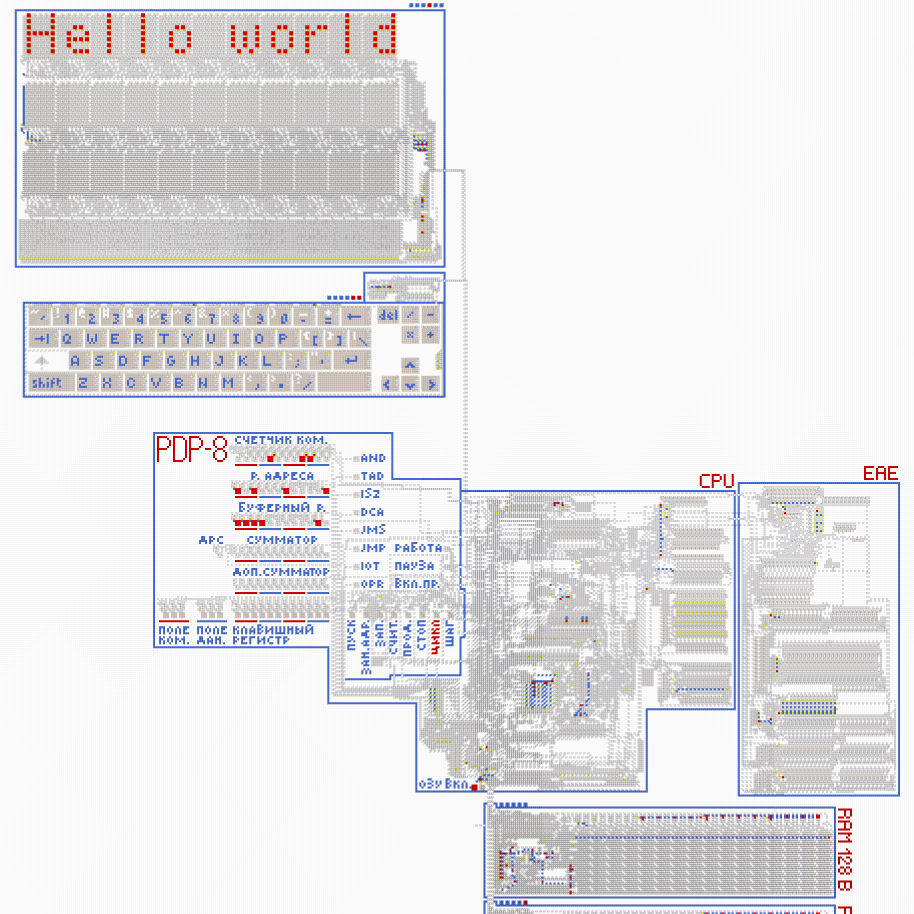

# PDP-8 в Стрелочках

Копия одного из первых массовых компьютеров [PDP-8](https://en.wikipedia.org/wiki/PDP-8) компании Digital Equipment Corporation 1965 года и его советской копии ЭВМ Элеткроника-100, сделанная в игре [Logic Arrows](https://www.youtube.com/channel/UCzdmz_lLWT_dPqOvFjXAMVg) или Стрелочки ютубера Onigiri (им сделана игра, а не компьютер).

Файлы документации (навигация):
* **[README.md](README.md) - введение, характеристики, готовые программы, дополнительная литература**
* [structure.md](structure.md) - комплектация компьютера, структура и характеристики его частей
* [starting-and-floppies.md](starting-and-floppies.md) - как запустить программу, генерация дискет
* [commands.md](commands.md) - система команд PDP-8

[
**Карта с компьютером**
](https://logic-arrows.io/map-rcLRm6iY)

## Характеристики
* 12-битная архитектура
* 8 основных команд и более 70 их вариаций (см. [Микрокоманды](commands.md#микрокоманды))
* Оперативная память до 32768 12-битных слов (48 КБ)
* 1 регистр общего назначения (аккумулятор)
* Возможность одновременного подключения до 55 внешних устройств

Преимущества компьютера:
* Так как компьютер PDP-8 реально существовал, под него уже было написано множество всяких программ, начиная операционными системами и заканчивая компиляторами. Значит, под мой PDP-8 есть куча уже написанных программ.
* Панель управления. В одном месте собраны сразу индикация всех основных регистров, а также средства ручного управления компьютером.
* Аппаратная реализация умножения и деления.

Недостатки:
* В сравнении с теми же [компьютером Чубрика](https://github.com/chubrik/LogicArrows/blob/main/computer-v2/README.md) или [компьютером Джипега](https://github.com/DimonSDF/Logic-Arrows/blob/main/Компьютер.md), мой PDP-8 очень медленный. То, что у Чубрика считалось минуту, у меня с памятью RAM 128 B считалось 10 минут.
* По словам некоторых умных людей (Каламы) у PDP-8 странная система команд.
* Дерьмовая реализация в Стрелочках. Если вы внимательно посмотрите на мой процессор, то увидите огромный клубок проводов, соединяющий разные части процессора, он очень запутанный, даже я скоро в нём перестану разбираться. Единственное, что по моему мнению у меня удалось, — это АЛУ и добавляемый арифметический блок, остальное - просто чудом работающая каша. Тот же компьютер Джипега состоит из красиво выстроенных проводов, идущих столбиками частей процессора, всё красиво и просто, а у меня кеся-меся.

## Программы
Пока я делал компьютер, я написал для него несколько программ на ассемблере PAL-III, лежащие в `.pal` файлах папки `/asm`. Всех их я компилировал с помощью компилятора [mkasm](https://github.com/Rex--/mkasm) с флагом `-D` (чтобы работали строки и символы). Во всём коде я старался оставлять поясняющие комментарии.
* [Hello World](asm/hello_world.pal) Небольшая программка, которая выводит в терминал сообщение "Hello world". _Адрес начальной команды: 2008_
* [Typewriter](asm/typewriter.pal) Программа длиной в 4 команды, которая печатает в терминал все символы, набранные на клавиатуре. _Адрес начальной команды: 2008_
* [Typewriter 2](asm/typewriter_2.pal) Модификация предыдущей программы, но в отличие от неё ставит символ ">" в начале каждой строки. _Адрес начальной команды: 2038_
* [Fibonacci](asm/fibonacci.pal) Ищет указанное в клавишном регистре количество чисел Фибоначчи и выводит в аккумулятор последнее. _Адрес начальной команды: 2008_
* [Prime numbers](asm/prime_numbers.pal) Ищет указанное в клавишном регистре количество простых чисел и выводит в аккумулятор последнее. Оригинальный код поиска простых чисел был написан Чубриком, я его переписал на PAL-III и адаптировал под PDP-8. _Адрес начальной команды: 2008_
* [Calculator](asm/calculator.pal) Калькулятор, который может выполнять операции сложения, вычитания, умножения и деления (последние две используют [добавляемый арифметический блок](structure.md#добавляемый-арифметический-блок-eae)). Занимает всего 1 страницу памяти, то есть менее 128 12-битных слов (192 байта). Чтобы выполнить операцию, просто введите сначала 1 операнд, затем знак операции (+, -, * или /), потом второй операнд и знак =, программа посчитает и выведет результат. Корректно работает с числами до 2048. Является переписанной под PDP-8 программой калькулятор от Джипега.

Также есть программа, скомпилированная под симулятор [simh](https://github.com/simh/simh) и лежащая в `.bin` файле папке `/bin`:
* [Hello.b](bin/hello.bin) Программа Hello World, выводящая соответсвующее сообщение в терминал, написана на языке программирования B и скомпилирована в двоичный формат. Занимает 3 страницы памяти. _Адрес начальной команды: 2008_

## Для продвинутых пользователей
Если вы хотите написать программу для PDP-8, ил вам было что-то непонятно из данной документации, или просто интересно подробнее узнать о компьютере и его устройстве, могу порекомендовать просмотреть эти книги:
* [**Программирование на "Электронике-100" для задач АСУ ТП**](https://drive.google.com/file/d/1vmhK0NIZLiQ4dXXuqZSGidAQa3xmekxR/view). Является подробной документацией к компьютеру Электроника-100, советской копии PDP-8. Она написана на русском языке, и в основном ей я руководствовался, когда собирал свой компьютер. У неё есть некоторые свои приколы, например, все регистры и инструкции написаны на русском, что довольно забавно. Но, так как это доки к копии оригинального компьютера, там нехватает части информации или она неполная/непонятная, например, о командах добавляемого арифметического блока или работе с дополнительными кубами памяти. Хотя там есть такая интересная информация, как приёмы программирования. И ещё, вместо ассемблера там используются 8-ричные коды команд, поэтому будьте готовы к восприятию команд по числам.
* [**PDP-8 users handbook**](https://drive.google.com/file/d/1rxcyWxEEiQccqOs57nSy3Z9BNSXV8r8J/view). Документация к оригинальному PDP-8, написана, соответственно на английском. Я её подробно не изучал, поэтому практически ничего сказать об этой документации не могу, кроме того, что там очень хорошо описана логика каждой команды.
* [**PAL III symbolic assembler programming manual**](https://drive.google.com/file/d/1Uk2Y2IRK8wGXVFDmNK-3lXeJEcIj4msU/view). Документация к ассемблеру PAL-III. Если вы собираетесь писать на ассемблере для PDP-8, обязательно прочтите эту книгу или хотя бы её часть.