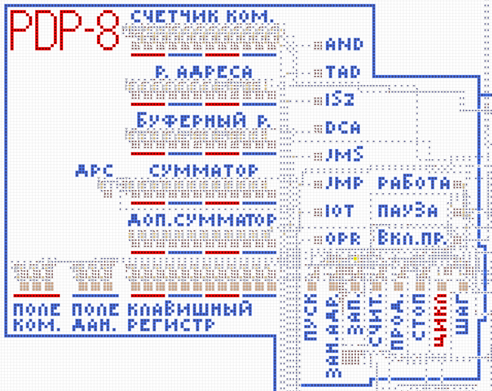

# Навигация
* [README.md](README.md) - введение, характеристики, готовые программы, дополнительная литература
* **[structure.md](structure.md) - комплектация компьютера, структура и характеристики его частей**
* [starting-and-floppies.md](starting-and-floppies.md) - как запустить программу, генерация дискет
* [commands.md](commands.md) - система команд PDP-8

# Структура и комплектация в Стрелочках
* Процессор с панелью управления: _CPU_
* Добавляемый арифметический блок с реализацией умножения и деления: _EAE_
* 3 уже подключенных блока памяти по 128 слов (по 1 странице): _RAM 128 B_
* отключенный куб памяти на 4096 слов с дисководом: _RAM 4096 A_
* Терминал 11x3 символа
* ASCII Клавиатура (сделана @chubrik)

## Процессор (CPU)

![Скриншот из игры, на нём видно процессор; выделены и подписаны основные части процессора: [Приёмник ответов от внешних устройств], [Обработчик команд обращения к внешним устройствам], [ДР], [Аккумулятор], [Дешифратор опкодов АЛУ], [Дешифратор команд], [Побитовое И], [Сумматор], [Микрокоманды 1-й группы], [Микрокоманды 2-й группы], [Блок генерации запросов к памяти], [РА]](images/cpu.png)

На изображении выделены и подписаны следующие части:
* Приёмник ответов от внешних устройств - получает сигналы от внешних устройств и обрабатывает их.
* Дешифратор опкодов АЛУ - дешифровывает опкоды, чтобы АЛУ выполнял необходимое действие (И, сложение, инкремент или микрокоманды).
* ДР - дополнительный разряд аккумулятора, бит переполнения.
* Аккумулятор - регистр общего назначения.
* СК - счётчик команд, содержит адрес команды, которую надо выполнить следующей.
* Побитовое И - блок, выполняющий операцию И между двумя операндами.
* Сумматор - складывает два числа, а также производит инкремент и проверку на 0.
* Микрокоманды 1-й группы - блок, обрабатывающий и выполняющий микрокоманды первой группы.
* Микрокоманды 2-й группы - блок, обрабатывающий и выполняющий микрокоманды второй группы, производящий переходы при определённых условиях.
* Обработчик команд обращения к внешним устройствам - содержит дешифратор соответствующей группы команд, регистры поля команд и поля данных, общий регистр для отправки запросов к устройствам.
* Дешифратор команд - дешифровывает основные 8 команд и отправляет сигналы частям процессора на их выполнение.
* Блок генерации запроса к памяти - составляет и отправляет запрос к памяти, управляет обращениями к памяти.
* РА - регистр адреса, содержит адрес ячейки, к которой происходит обращение.

У реального PDP-8 есть регистр, которого нет в моей реализации в Стрелочках, — буферный регистр. У меня есть его индикация на панели управления (что такое панель управления смотри в соответствующем [разделе](#панель-управления)), но его явной реализации нет в самом процессоре.

## Панель управления

Панель управления используется в основном для дебагинга и написания программ, управления процессором и компьютером в целом.

На ней находятся индикаторы основных регистров процессора, состояния процессора, выполняемой команды, также есть рад кнопок для ручного управления работой компьютера.

Индикаторы и регистры:
* Счетчик ком. - счётчик команд - содержит адрес следующей команды.
* Р. адреса - регистр адреса - показывает адрес ячейки памяти, к которой происходило обращение в последний раз.
* Буферный р. - буферный регистр - указывает на данные, которые были прочитаны или занесены в память в последний раз.
* Сумматор - аккумулятор - основной регистр, с которым происходят все вычисления и манипуляции, в него записываются данные из памяти и из него данные записываются в память.
* ДРС - дополнительный разряд сумматора - бит переполнения аккумулятора.
* Доп. сумматор - дополнительный сумматор - регистр добавляемого арифметического блока, может выступать как продолжения аккумулятора для операций с 24-битными числами или как один из множителей при операции умножения.
* AND, TAD, ISZ, DCA, JMS, JMP, IOT, OPR - индикаторы выполнения основных команд процессора в текущий момент.
* Работа - индикатор, означающий, что процессор работает.
* Пауза - индикатор включается, когда процессор ждёт ответа от внешнего устройства.
* Вкл. пр. - включить прерывания - индикатор, означающий включённые или выключенные прерывания.
* Поле ком. - поле команд - кнопки, управляющие регистром поля команд, указывающим на куб памяти, используемый для получения команд процессора; важно, что индикация над кнопками меняется только при нажатии самих кнопок, но не при программном изменении значения регистра.
* Поле дан. - поле данных - аналогичные полю команд индикация и кнопки, но регистр поля данных отвечает за куб памяти, используемый для всех данных, кроме команд.
* Клавишный регистр - регистр, который может использоваться для занесения информации в процессор (его можно программно считывать), взаимодействия с памятью компьютера.

Клавиши управления:
* Пуск - обнуляет аккумулятор (сумматор) и начинает выполнение программы с указанного в счётчике команд адреса.
* Зан. адр. - занесение адреса - переносит код, набранный на клавишном регистре в счётчик команд.
* Зап. - запись - заносит код, набранный на клавишном регистре и проходящий через аккумулятор, в память в ячейку с кодом из счётчика команд, после чего счётчик команд увеличивается на 1, а аккумулятор обнуляется.
* Счит. - считывание - заносит данные из ячейки памяти, код которой содержится в счётчике команд, в аккумулятор, после чего счётчик команд увеличивается на 1.
* Прод. - продолжение - начинается выполнение программы без обнуления аккумулятора.
* Стоп - останавливает работу процессора после выполнения текущей команды.
* Цикл (не работает) - если активирована, при нажатии клавиши "Продолжение", выполняется один машинный цикл одной команды (команда разбивается на этапы, которые выполняются по одному).
* Шаг - если активирована, при нажатии клавиши "Продолжение", будет выполняться одна команда, то есть команды выполняются по одной.

В самом низу процессора, вне панели управления, есть кнопка "озу вкл.", которая блокирует любое взаимодействие памяти с процессором, когда выключена.

## Оперативная память (RAM)

Компьютер поддерживает до 32768 слов памяти, но в Стрелочках она бы очень медленно работала из-за своих размеров. К тому же не все программам необходим такой объём памяти, а тем более самописным программам, которым может понадобиться на более 3 страниц памяти.

На карте есть 2 вида памяти: 4096 A, 128 B.

### RAM 4096 A
Объём - 4096 12-битных слов, то есть 1 куб памяти. Длина адреса - 12 бит, из которых старшие 5 бит - номер страницы, а остальные 7 - номер ячейки на странице памяти.

Страницы памяти с 1 по 31 реализованы как память с длинными кольцами, что позволяет компактно упаковывать большой объём памяти. Но из-за такого метода страдает скорость, так как, чтобы выполнить какую-нибудь операцию, надо дождаться, пока нужное слово не "дойдёт" до определённого места, где его можно перезаписать или считать.

Нулевая страница реализована как кольцевая память с перекрёстной адресацией. Такой вид памяти не очень компактный, но зато быстрый, учитывая что нулевая страница имеет большое значение в PDP-8. Эта страница памяти имеет индексные ячейки памяти с адресами 00108 - 00178. При косвенном обращении они увеличиваются на 1.

Напрямую к кольцам памяти подключён дисковод с портами для дискет всех страниц памяти, которые могут загружаться параллельно при нажатии кнопки в левом верхнем углу дисковода. Дискеты вставляются в порты так, чтобы корпус дискеты идеально совпадал с корпусом порта. Номер дискеты и номер порта должны совпадать.

### RAM 128 B
Объём - 128 12-битных слов, то есть одна страница памяти. Длина адреса та же, что и в RAM 4096 A, но реагировать будет только на запросы, касающиеся именно этой страницы памяти.

Имеет две вариации: нулевая и ненулевая страница. Нулевая практически такая же, как и нулевая страница RAM 4096 A, имеет индексные ячейки. Ненулевая является модифицированной нулевой, но с удалённым механизмом индексных ячеек. На их корпусе есть отметки с номером страницы. На карте есть 3 таких блока памяти, но при необходимости можно подключать ещё.

Этот вид памяти имеет преимущество перед версией A - скорость, программы могут выполняться значительно быстрее.

Для большей скорости загрузки дискеты подключаются к каждой странице отдельно.

## Добавляемый арифметический блок (EAE)
Как видно из названия, является необязательной частью компьютера.
Выполняет действия умножения, деления, различного рода сдвигов. Является продолжением АЛУ, принимает те же самые опкоды. Имеет свой регистр, который может быть как продолжением аккумулятора для выполнения операций с 24-битными числами, так и одним из операндов для операции умножения или частью результата после вычислений. Также есть 5-битный счётчик шагов, который показывает количество выполненных шагов за одну циклическую операцию (на самом деле он имеет значение в данной реализации PDP-8 и меняется только во время выполнения команды нормализации).

![Скриншот из игры, на нём видно добавляемый арифметический блок; выделены и подписаны основные части: [Дешифратор опкодов АЛУ], [Регистр ДАБ], [Аккумулятор], [Сумматор], [Блок нормализации], [Блок умножения], [блок деления], [Блок сдвига влево], [Блок сдвига вправо]](images/eae.png)

Выделены и подписаны следующие части:
* Дешифратор опкодов АЛУ - определяет, какую команду надо выполнить, разбивает команды на более мелкие операции.
* Регистр ДАБ - регистр добавляемого арифметического блока - регистр множителя-частного - внутренний регистр, выполняющий различные функции.
* Аккумулятор - копия аккумулятора из основного процессора.
* Сумматор - блок сложения, используется для сложения аккумулятора с регистром ДАБ или счётчиком шагов.
* Блок нормализации - блок, выполняющий операцию нормализации, то есть сдвиг 24-битного числа (объединение аккумулятора и регистра ДАБ) влево до тех пор, пока старший и следующий за ним бит не станут разными или число в аккумуляторе станет равным 60008.
* Блок умножения - производит умножение между регистром ДАБ и содержимым ячейки памяти, следующей за командой умножения, сохраняет результат в объединённый регистр аккумулятора и регистра ДАБ.
* Блок деления - производит операцию деления между объединённым содержимым аккумулятора и регистром ДАБ на ячейку памяти, следующую за командой деления, сохраняет частное в регистр ДАБ, а остаток - в аккумулятор.
* Блок сдвига влево - производит сдвиг влево объединённого содержимого ДР, аккумулятора и регистра ДАБ на количество разрядов, указанное в следующей за командой ячейке памяти.
* Блок сдвига вправо - выполняет 2 операции: арифметический сдвиг вправо и логический сдвиг вправо; первая сдвигает всё объединённое содержимое ДР, аккумулятора и регистра ДАБ вправо, при этом знаковый бит сохраняется и сдвигается вправо, ДР становится равным знаковому биту; вторая сдвигает всё объединённое содержимое ДР, аккумулятора и регистра ДАБ вправо, сдвигая содержимое ДР в знаковый бит, а сам ДР обнуляя; в обоих случаях сдвиг происходит на количество разрядов, указанное в следующей за командой ячейке памяти.

## Клавиатура (сделана @chubrik)
Поддерживает все печатаемые и некоторые управляющие (\b, \r, \t, DEL, DC1-4) символы кодировки ASCII, во многом повторяет клавиатуру QWERTY, имеет одну модифицирующую клавишу Shift.

В левом верхнем углу контроллера клавиатуры есть индикатор, показывающий состояние флага ввода (если он горит, значит процессор ещё не считал данные с клавиатуры).

Код устройства: 038

## Терминал
Сегментный терминал (тот, у которого каждый символ является отдельным сегментом), поддерживающие все печатаемые и некоторые управляющие (\b, \n, \v, \r) символы ASCII. Размер терминала: 11x3 символа. Размер символа: 5x7 пикселей.
Когда курсор достигает края строки, он переходит в начало следующей строки.
Когда курсор выходит за пределы последней строки, он исчезает... Когда-нибудь этот баг исправлю.

Шрифт взят с сайта https://fontmeme.com/fonts/grand9k-pixel-font/ , но я и Чубрик его немного модифицировали.

Код устройства: 048